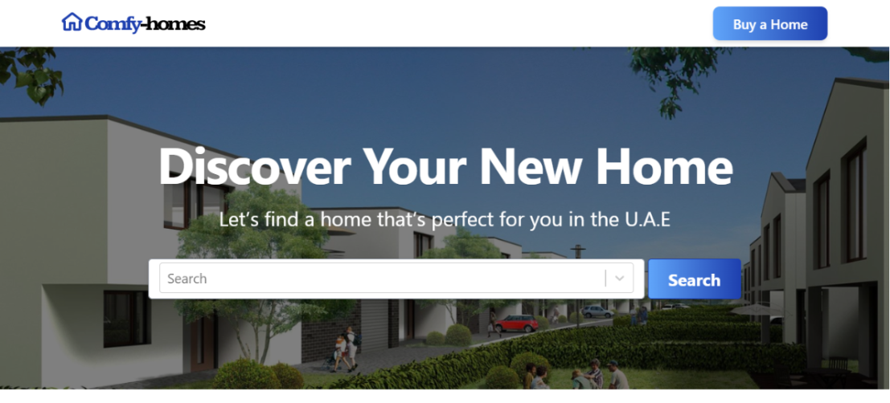

# Comfy-homes

This is a real estate website built using nextjs and styled using tailwindcss. The frontend  of the website communicates with RapidAPI's rest endpoints using both the static site generation and server side rendering functionalities of nextjs.
The map functionality was implemented using google map api.
[View Live Demo](https://comfy-homes.vercel.app/)




## Local Development

1. Clone the repository

```bash
git clone https://github.com/idemmanuel001/comfy-homes
```

2. Navigate into repository

```bash
cd comfy-homes
```

3. Install the dependencies

```bash
npm install
```

4. Start the development server

```bash
npm run dev
```

5. Start the build mode

```bash
npm run build
```